# Supavolt

**A self-hostable backend-as-a-service**: create a project and you get a Postgres schema, a REST
API over its tables, file storage, realtime change events and end-user authentication, all
managed from a web dashboard.

It is built with **Java 17 / Spring Boot 4** (Spring MVC, Spring Security, JPA + JdbcClient,
Flyway, WebSockets) and a **Next.js 16 + TypeScript** dashboard, on **PostgreSQL 17** and
**S3-compatible storage** (RustFS locally).

- [What you get](#what-you-get)
- [How it fits together](#how-it-fits-together)
- [Run it locally](#run-it-locally)
- [How the main flows work](#how-the-main-flows-work)
- [Security model](#security-model)
- [Repository layout](#repository-layout)
- [API reference](#api-reference)
- [Tests](#tests)
- [Troubleshooting](#troubleshooting)
- [Not built yet](#not-built-yet)

---

## What you get

| Feature | What it does |
| --- | --- |
| **Organizations & members** | Sign up, create orgs, invite teammates as `admin` or `developer`. |
| **Projects** | Each project gets its own Postgres schema, an **anon key** (public, read-only) and a **service-role key** (secret, full access, shown once). |
| **Table editor** | Create tables and browse rows from the dashboard. |
| **SQL editor** | Run SQL against your project, with history. Runs under a database role that can only see that project. |
| **REST data API** | `GET/POST/PATCH/DELETE /api/projects/{project}/rest/{table}` with filters like `?price=lt.100&order=id.desc`. |
| **Storage** | Buckets and files. Uploads go straight from the browser to S3 via presigned URLs. |
| **Realtime** | Turn on a table and every insert, update and delete is pushed to subscribed clients over WebSockets. |
| **Project auth** | Sign-up and sign-in for *your app's* users, with per-project JWTs. |

---

## How it fits together

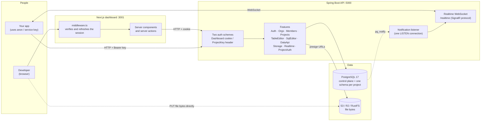

The two halves share no code at build time. The contract between them is HTTP plus
`frontend/lib/types.ts`, which mirrors `backend/contracts/.../Contracts.java` by hand.

### What lives where in Postgres

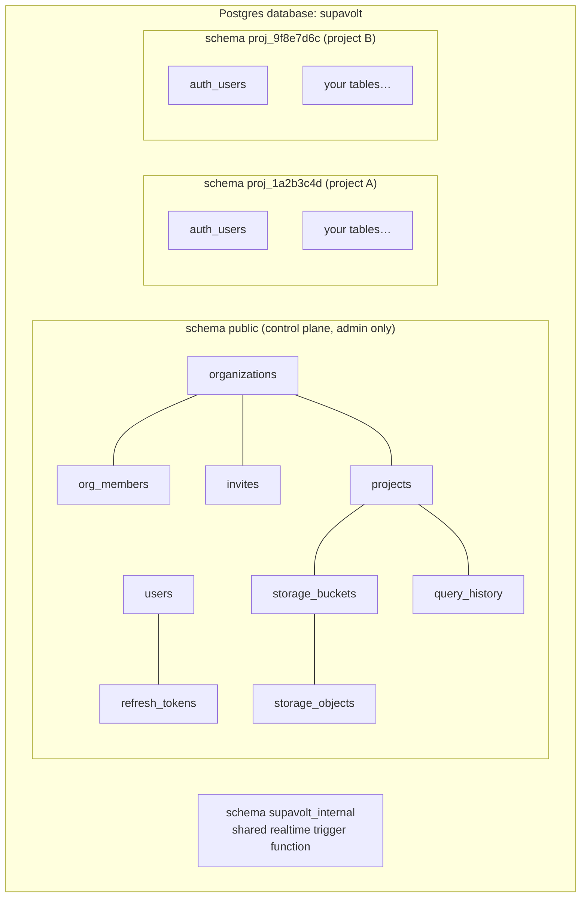

<details>
<summary>Control-plane entity diagram</summary>

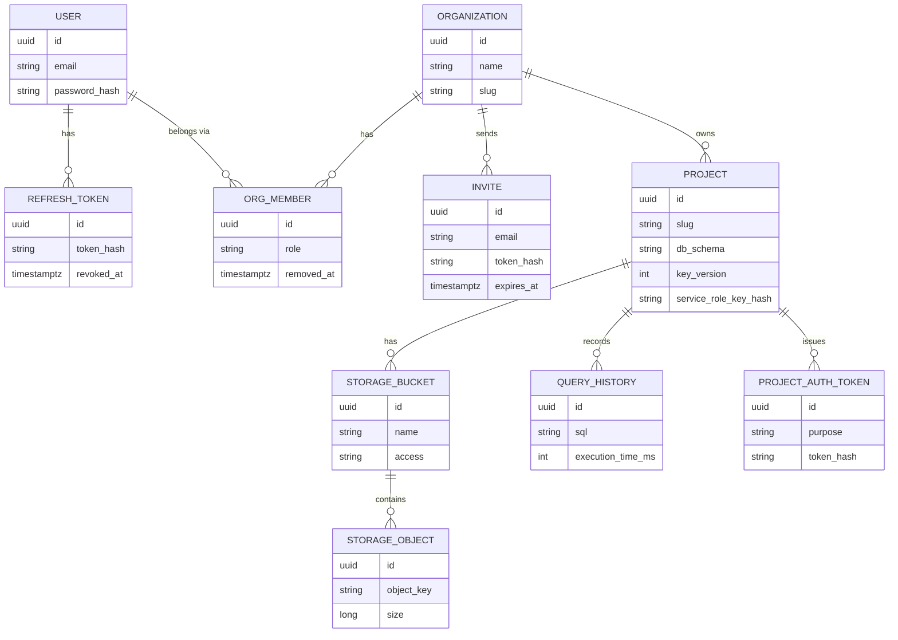

</details>

---

## Run it locally

You need three things running: **Postgres + S3 storage** (in Docker), the **API**, and the
**dashboard**. There are two ways to run the API. Pick one:

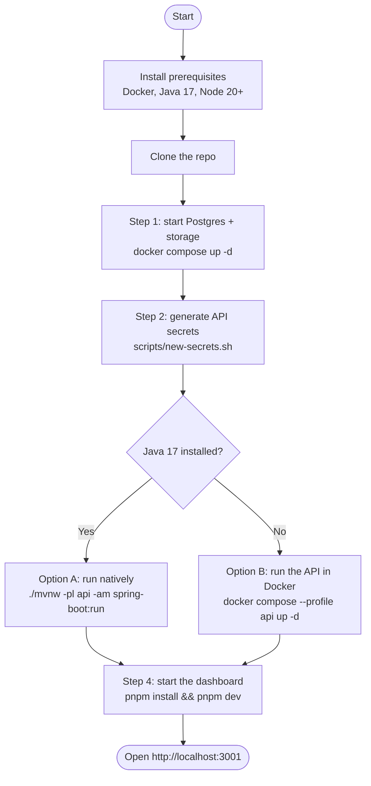

### Prerequisites

| Tool | Version | Check |
| --- | --- | --- |
| [Docker Desktop](https://www.docker.com/products/docker-desktop/) | any recent | `docker --version` |
| Java (e.g. [Eclipse Temurin](https://adoptium.net/)) | 17 or newer (not needed for Option B) | `java -version` |
| [Node.js](https://nodejs.org/) | 20 or newer | `node -v` |
| pnpm (optional, `npx pnpm` works too) | any | `pnpm -v` |
| Git | any | `git --version` |

Maven is not needed: the repo ships the Maven wrapper (`backend/mvnw`), which downloads the
pinned version on first use.

The commands below are for a **bash-style shell**: macOS/Linux Terminal, or **Git Bash** on
Windows (use `mvnw.cmd` from `cmd`/PowerShell). Git Bash includes `openssl`, which is used to
generate secrets.

### Step 1: Clone and start Postgres + storage

```bash
git clone https://github.com/Ridzzz0Alam/supavolt.git
cd supavolt/backend
docker compose up -d
```

This starts:

| Container | Port | Login |
| --- | --- | --- |
| `postgres` | 5432 | `supavolt_admin` / `supavolt`, database `supavolt` |
| `storage` ([RustFS](https://rustfs.com), S3-compatible) | 9000 (S3), 9001 (web console) | `supavolt` / `supavolt123` |

On first start, Postgres runs `db/init/01-roles.sql`, which creates the least-privilege
`supavolt_tenant` role. Check that it exists:

```bash
docker compose exec postgres psql -U supavolt_admin -d supavolt -c "\du"
```

> Something else already on port 5432? Change the left-hand port in `docker-compose.yml` and
> point the API at it: `export SPRING_DATASOURCE_URL=jdbc:postgresql://localhost:<port>/supavolt`.

### Step 2: Generate the API secrets

Secrets never go in `application.yml`. They live in a file outside the repo, which the API reads
on start (`SUPAVOLT_SECRETS_FILE`, default `~/.config/supavolt/secrets.yml`):

```bash
scripts/new-secrets.sh        # still in backend/
```

It prints the `JWT_ACCESS_SECRET` line you will need in Step 4. Any setting can also come from an
environment variable instead: `supavolt.jwt.access-secret` is `SUPAVOLT_JWT_ACCESSSECRET`.

Optional: to enable "Continue with Google / GitHub" on the dashboard login page, add to the same
file:

```yaml
supavolt:
  oauth:
    google: { client-id: ..., client-secret: ... }
    github: { client-id: ..., client-secret: ... }
```

The callback URLs to register with the providers are
`http://localhost:5000/api/auth/google/callback` and `.../api/auth/github/callback`. If they are
not set, those buttons send you back to the login page and everything else works.

### Step 3: Run the API

#### Option A: run natively

```bash
# still in backend/
./mvnw -pl api -am spring-boot:run
```

`spring-boot:run` uses the `dev` profile: local database passwords, plain-http cookies, the API
reference, and it creates the `supavolt-dev` storage bucket if it is missing. Flyway creates the
control-plane tables on the first start.

#### Option B: run the API in Docker

No Java needed: the API builds and runs in a JDK container and reads the same secrets file.

```bash
cd backend
docker compose --profile api up -d        # first start downloads Maven and builds: a minute or two
docker compose logs -f api                # wait for "Started SupavoltApplication"
```

**Either way, check it's up:**

```bash
curl http://localhost:5000/api/health
# {"status":"ok","timestamp":"..."}
```

In development there is also an interactive API reference at **http://localhost:5000/api/docs**
(the OpenAPI document is `/api/openapi/v1.json`).

### Step 4: Start the dashboard

```bash
cd frontend
cp .env.example .env.local
```

Open `frontend/.env.local` and set `JWT_ACCESS_SECRET` to **the same value** as the API's
`supavolt.jwt.access-secret` (Step 2 printed it). The dashboard verifies session tokens itself, so
the two must match. The finished `frontend/.env.local` looks like this:

```ini
NEXT_PUBLIC_API_URL=http://localhost:5000/api
API_URL=http://localhost:5000/api
JWT_ACCESS_SECRET=<same as supavolt.jwt.access-secret>
JWT_ISSUER=supavolt
JWT_AUDIENCE=supavolt-dashboard
```

Then install and run:

```bash
pnpm install      # or: npx pnpm install
pnpm dev          # or: npx next dev --port 3001
```

Open **http://localhost:3001**, register an account, and create your first project.

### Try it out

1. **Projects**: create one and copy the **service-role key**. It is shown only once.
2. **Table editor**: create a `todos` table with a `title` text column.
3. **SQL editor**: `insert into todos (title) values ('hello');`
4. **REST API**: read it back with the anon key:
   ```bash
   curl "http://localhost:5000/api/projects/<project-slug>/rest/todos" \
     -H "Authorization: Bearer <anon key>"
   ```
5. **Realtime**: tick `todos`, then insert another row from the SQL editor in a second tab and
   watch the event arrive.
6. **Storage**: create a bucket and upload a file.

### Stopping and starting again

```bash
# stop (keeps all data)
cd backend && docker compose --profile api stop       # and Ctrl+C the dashboard / spring-boot:run

# start again later
cd backend && docker compose up -d                    # Option B: docker compose --profile api up -d
cd backend && ./mvnw -pl api -am spring-boot:run      # Option A only
cd frontend && pnpm dev

# wipe everything and start fresh (deletes all data)
cd backend && docker compose --profile api down -v
```

### Ports at a glance

| Port | Service |
| --- | --- |
| 3001 | Dashboard (Next.js) |
| 5000 | API: `/api/...`, realtime at `/realtime`, API docs at `/api/docs` (dev) |
| 5432 | PostgreSQL |
| 9000 / 9001 | S3 storage API / storage web console |

---

## How the main flows work

### Signing in to the dashboard

The dashboard never stores tokens in JavaScript. The API sets two **HttpOnly cookies**, and the
Next.js middleware checks them on every page load.

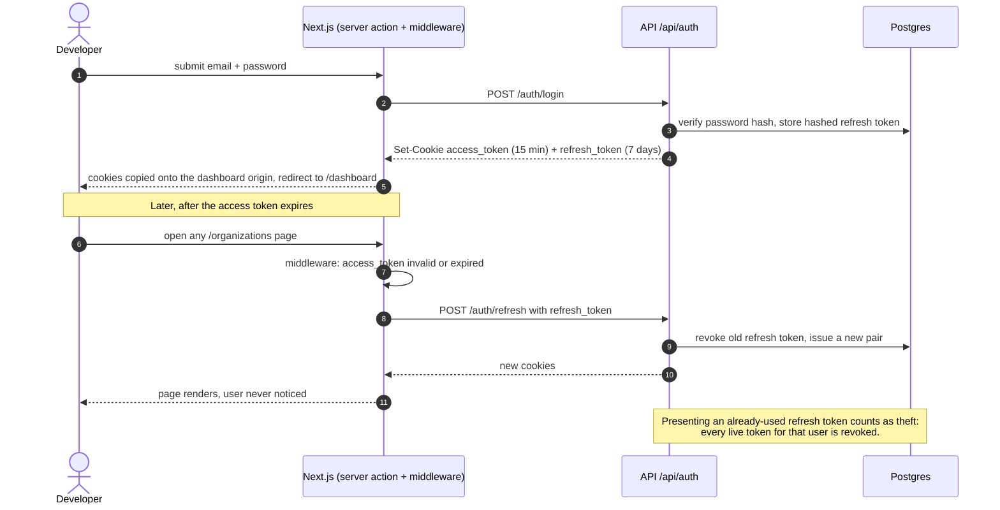

### Calling the REST data API with a project key

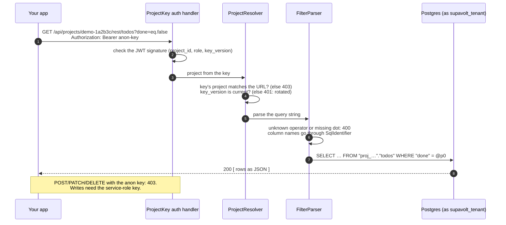

Filter syntax: `?column=op.value` with `eq, neq, gt, gte, lt, lte, like, ilike, is`, plus
`select=a,b`, `order=col.desc`, `limit` (max 1000) and `offset`.

### Creating a project

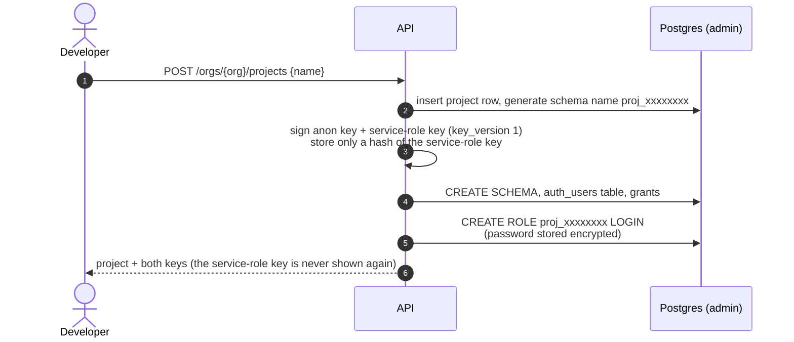

### Uploading a file (presigned URL)

File bytes never pass through the API, so a large upload costs the server nothing.

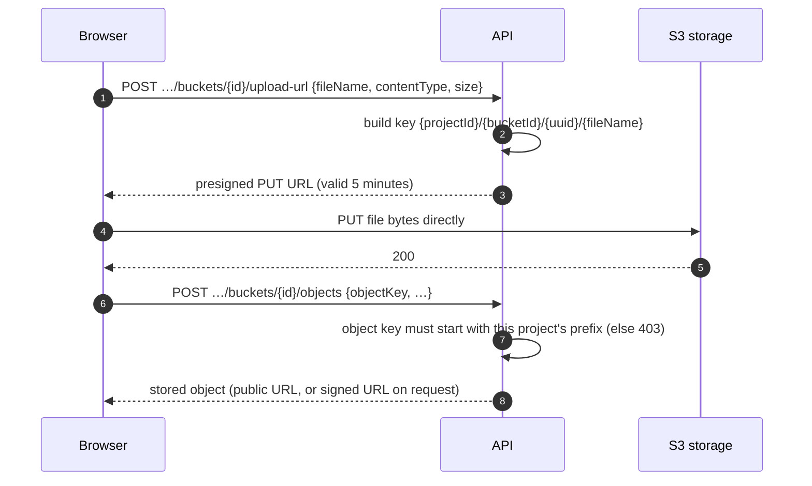

### Realtime change events

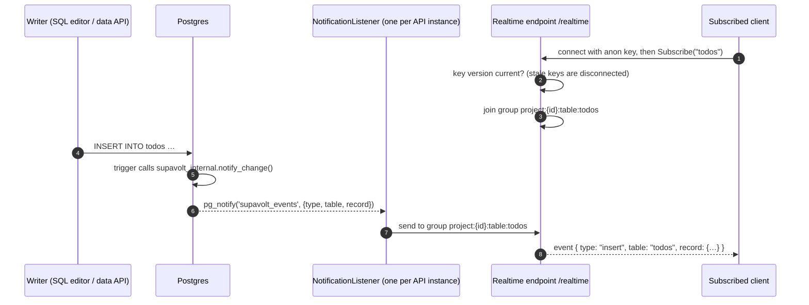

One Postgres channel, one trigger function and one listening connection serve every project and
table. `/realtime` speaks the SignalR JSON protocol over a plain WebSocket, so the dashboard's
`@microsoft/signalr` client connects to it as is. Running several API instances needs a shared
broker (see [Not built yet](#not-built-yet)).

---

## Security model

### Who can call what

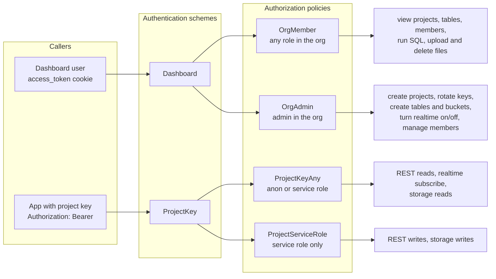

A project key can never act on dashboard routes, and a dashboard session can never call the data
API. They are separate schemes on purpose.

### Database roles: why one project can't see another

User-written SQL is contained by **Postgres privileges**, not by scanning the SQL text for
dangerous words, because that is easy to get around.

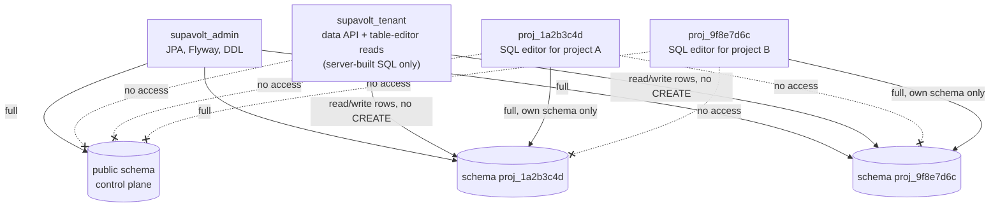

| Connection | Postgres role | Used by |
| --- | --- | --- |
| `spring.datasource.*` | `supavolt_admin` | JPA, Flyway, DDL, introspection |
| `supavolt.database.tenant-*` (same URL) | `supavolt_tenant` | data API, table-editor reads |
| per project (derived) | `proj_xxxxxxxx` | the SQL editor for that project |
| `supavolt.database.direct-url` (default: admin URL) | `supavolt_admin`, not pooled | the single realtime LISTEN connection |

Every SQL editor run is also wrapped in `SET LOCAL statement_timeout = '15s'`.

### Other rules the code follows

- **Values are always JDBC parameters. Identifiers (table, column, schema names) always go
  through `SqlIdentifier`**, which allows only `^[a-zA-Z_][a-zA-Z0-9_]{0,62}$`.
- **Secrets are write-only.** Service-role keys are stored as hashes. OAuth client secrets and
  project role passwords are encrypted with AES-256-GCM (`SecretProtector`), and the API reports only
  `googleConfigured: true`, never the secret itself.
- **Keys can be rotated.** Every key carries a `key_version`. Rotating bumps the version, so all
  older keys, including open realtime connections, stop working.
- **Errors don't leak internals.** Postgres errors become RFC 9457 ProblemDetails without raw
  database messages. The one exception is the SQL editor, which shows the real message because
  its user wrote the SQL.

See [`DECISIONS.md`](DECISIONS.md) for the reasoning behind these choices and what changed while
the codebase was brought up.

---

## Repository layout

```
supavolt/
├── README.md                     you are here
├── DECISIONS.md                  design decisions and the fixes behind them
├── INSTRUCTIONS.md               runbook: build, run, smoke test
├── backend/
│   ├── pom.xml                   Maven parent: Spring Boot 4.1, Java 17, warnings as errors
│   ├── mvnw, .mvn/               Maven wrapper (no Maven install needed)
│   ├── docker-compose.yml        postgres, storage (RustFS), and the optional `api` container
│   ├── db/init/01-roles.sql      creates the supavolt_tenant role
│   ├── scripts/new-secrets.sh    writes ~/.config/supavolt/secrets.yml
│   ├── contracts/                Contracts.java: request/response records and enums (the API's public shape)
│   └── api/src/
│       ├── main/java/dev/supavolt/api/
│       │   ├── config/           properties, security chains, CORS, JSON, errors, rate limits
│       │   ├── common/           AppException, row mapping, tokens, slugs
│       │   ├── infrastructure/   persistence (entities, repositories, encryption), mail,
│       │   │                     tenancy (SqlIdentifier, connections, schema and role provisioning)
│       │   └── features/         one package per feature: service + controller
│       │       auth · orgs · members · projects · tableeditor · sqleditor
│       │       dataapi · realtime · storage · projectauth
│       ├── main/resources/       application.yml, application-dev.yml, db/migration (Flyway)
│       └── test/java/            unit tests + integration tests (Testcontainers)
└── frontend/
    ├── middleware.ts             session check and refresh on every page load
    ├── app/                      routes: login, register, organizations, projects,
    │                             database, sql, storage, realtime, auth, api, members
    ├── features/                 client components per dashboard area
    ├── components/               shared UI primitives
    └── lib/
        ├── api.ts                typed fetch wrapper
        ├── types.ts              hand-kept mirror of Contracts.java
        ├── server-data.ts        all server-side reads, cookie forwarded
        ├── actions.ts            all server actions (writes)
        └── realtime.ts           realtime client (@microsoft/signalr)
```

---

## API reference

All routes are under `http://localhost:5000/api`. Full interactive docs: `/api/docs` (development).

| Area | Routes | Auth |
| --- | --- | --- |
| Dashboard auth | `POST /auth/register` · `/auth/login` · `/auth/refresh` · `/auth/logout` · `GET /auth/me` · `GET /auth/invite/accept` | cookies |
| Orgs | `GET/POST /orgs` (any signed-in user) · `GET /orgs/{org}` | OrgMember |
| Members | `GET /orgs/{org}/members` · `POST …/invite` · `PATCH …/{id}/role` · `DELETE …/{id}` | read: OrgMember, changes: OrgAdmin |
| Projects | `GET /orgs/{org}/projects` · `GET …/{project}` · `POST /orgs/{org}/projects` · `POST …/{project}/keys/rotate` | read: OrgMember, create/rotate: OrgAdmin |
| Tables | `…/projects/{project}/tables` (list, create, drop, columns, rows) | read: OrgMember, schema changes: OrgAdmin |
| SQL | `POST …/projects/{project}/sql` · `GET …/sql/history` | OrgMember |
| Realtime | `GET …/realtime` · `POST …/realtime/{table}/enable` · `DELETE …/disable` | read: OrgMember, toggle: OrgAdmin |
| Storage | `…/projects/{project}/storage/…` buckets, objects, upload URLs, signed URLs | files: OrgMember, buckets: OrgAdmin |
| **Data API** | `GET /projects/{project}/rest/{table}` · `POST` · `PATCH/DELETE …/{table}/{id}` | read: any project key, write: service role |
| **App storage** | `/projects/{project}/storage/buckets/{name}/…` | read: any project key, write: service role |
| **App auth** | `POST /projects/{project}/auth/signup` · `/signin` · `/magic-link` · `/exchange` | public, rate-limited |
| Health | `GET /health` | none |
| Realtime | `POST /realtime/negotiate`, then `ws://localhost:5000/realtime?access_token=<key>` (SignalR JSON protocol) | project key |

---

## Tests

```bash
cd backend
./mvnw verify                                       # Option A: build, unit + integration tests, coverage
docker compose exec api ./mvnw -B verify            # Option B
```

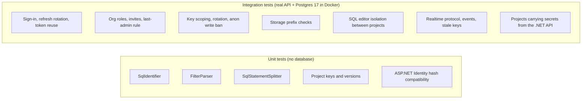

Integration tests start their own throwaway Postgres with
[Testcontainers](https://java.testcontainers.org/), so **Docker must be running**. They never
touch your development database or read your secrets file. The coverage report lands in
`api/target/site/jacoco/index.html`.

---

## Troubleshooting

| Symptom | Cause and fix |
| --- | --- |
| Dashboard keeps sending you back to `/login` | `JWT_ACCESS_SECRET` in `frontend/.env.local` doesn't match the API's `supavolt.jwt.access-secret`. Restart `pnpm dev` after changing it. |
| API won't start: *"Binding to target … SupavoltProperties failed"* | A secret from Step 2 is missing; the message names it. Check `~/.config/supavolt/secrets.yml` (or `SUPAVOLT_SECRETS_FILE`). |
| Option B: *"secrets.yml … is a directory"* | The secrets file didn't exist when the container started, so Docker created a directory in its place. Delete it, run `scripts/new-secrets.sh`, start again. |
| API won't start: *"Migrations have failed validation"* | A migration file applied to this database was edited afterwards. Add a new `V2__…` migration instead of editing an applied one. |
| File upload fails / download 404s | The `supavolt-dev` bucket doesn't exist. The dev profile creates it on start; otherwise create it in the storage console at http://localhost:9001. |
| `supavolt_tenant` role missing | `01-roles.sql` only runs on a **fresh** Postgres volume. Run `docker compose down -v` (deletes data) and `up -d` again. |
| Port 3001 or 5000 already in use | Another process holds it. On Windows: `Get-NetTCPConnection -LocalPort 5000` shows the owner. WSL's `wslrelay.exe` sometimes holds 5000; `wsl --shutdown` frees it. |
| `pnpm install` stops with *ignored build scripts* | Already answered in `frontend/pnpm-workspace.yaml`. Make sure you have the latest version of that file. |
| Many 429 errors on login/register | Auth routes allow 10 requests per minute per IP. Wait a minute. |

---

## Not built yet

- **Row-level security.** The anon key can read every row of every table in its project.
  `ProjectAuthService.validateEndUserToken` is the hook to build it on.
- **Per-project Google/GitHub sign-in for app users.** Credentials can be saved, but the OAuth
  redirect and callback endpoints are not written.
- **Multiple API instances.** Realtime groups live in one process's memory. Several instances
  need a shared fan-out (Redis pub/sub or a message broker) and a single elected listener.
- **A Java client SDK.** The HTTP API is stable enough to write one on `java.net.http`; the
  realtime side can use Microsoft's Java SignalR client against `/realtime`.
